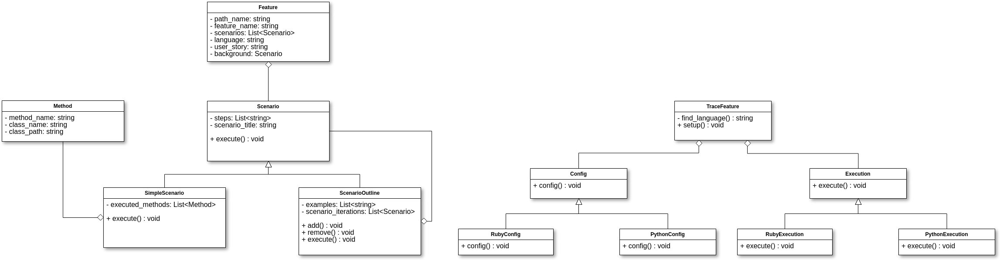
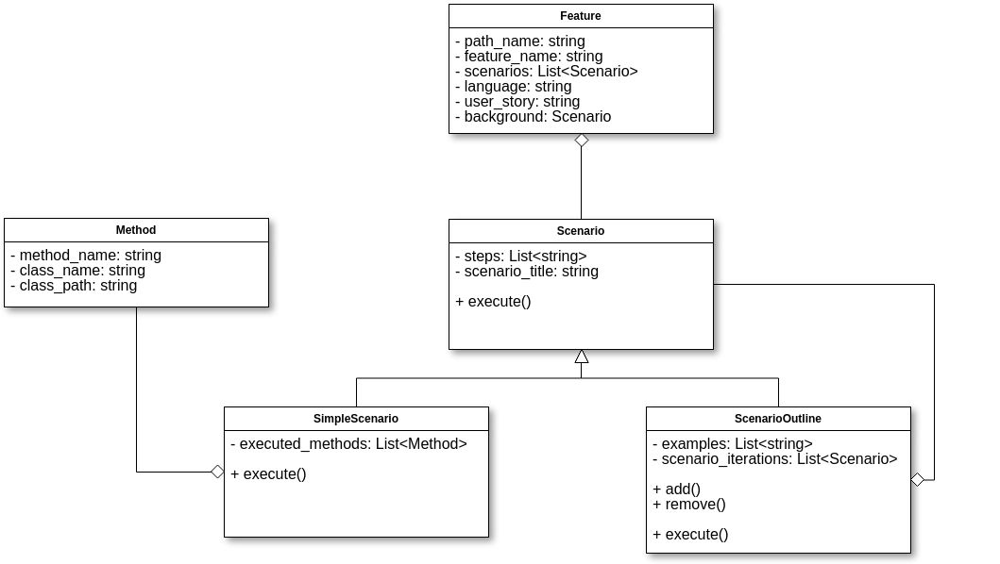

# Diagrama de Classes

## Versão Atual - 10/06/2018
Aqui se encontra a versão mais atual do diagrama, de acordo com a implementação. À medida que o sistema evolui, deve ser gerada uma versão nova do modelo, se necessário.  

## Pontos de Reutilização
### O sistema apresenta dois módulos bem distintos:

O **1º**  Possui responsabilidade modelar o contexto a ser analisado, criando a estrutura que servirá de base para a criação do JSON final. Este, a princípio, não é extensível, pois está relacionado à lógica interna e específica da biblioteca: define o formato de uma Feature, de um Cenário, etc.

O **2º** módulo diz respeito às diversas estratégias que podem ser aplicadas para a configuração e execução do rastreamento de features - aqui se encontra a capacidade de reutilização e extensão do sistema.

- Caso um usuário deseje adicionar algum passo extra de verificação, ou adicionar suporte a uma nova linguagem ou *framework*, por exemplo, basta adicionar suas próprias classes de configuração e execução, contanto que estejam conformes à interface definida nas classes BaseConfig e BaseExecution.

## Versões Anteriores

### 09/06/2018

