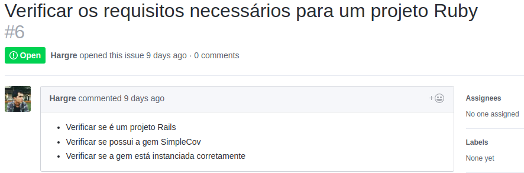
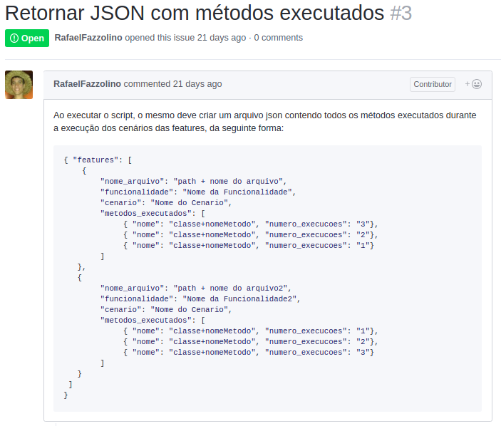

### Histórico de Revisões

| Data | Versão | Descrição | Autor(es) |
|:----:|:------:|:---------:|:-----:|
|30/05/2018|1.0|Criação do Documento| Letícia |
|17/06/2018|2.0|Fechamento do Documento| Letícia |

# Elicitação de Requisitos

Nossa biblioteca, por se tratar de um projeto de contribuição, iniciou-se, em seu controle de versão, a partir de um fork realizado do projeto já existente, do aluno de mestrado do departamento de ciência da computação, Rafael Fazzolino, que possui um repositório com a versão inicial da biblioteca, que pode ser encontrado
*[aqui](https://github.com/BDD-OperationalProfile/trace_feature)*.

Os requisitos foram rastreados como issues no repositório original, pelo próprio Rafael, que atuou como P.O dentro do nosso desenvolvimento.

Através de reuniões constantes com o P.O, 

